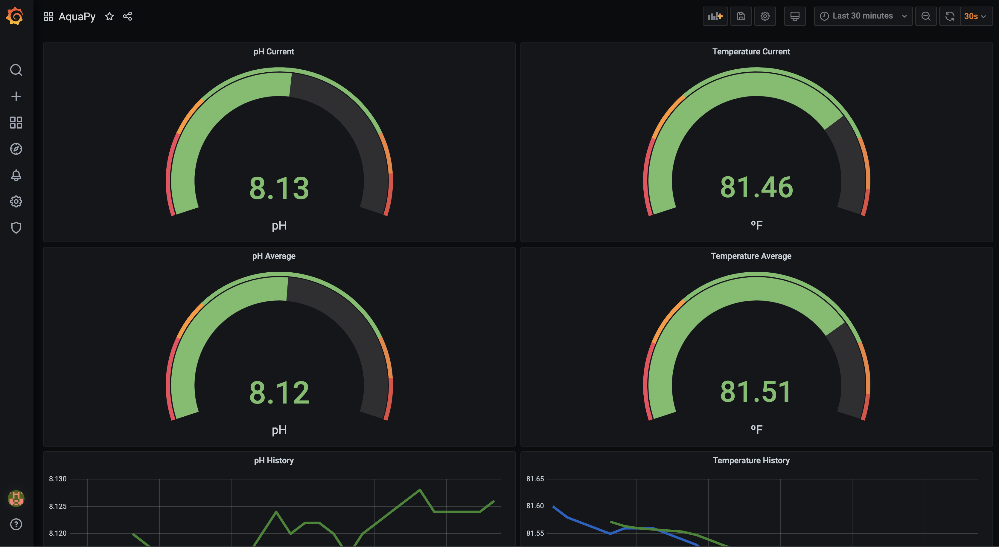
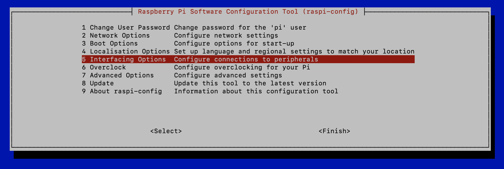
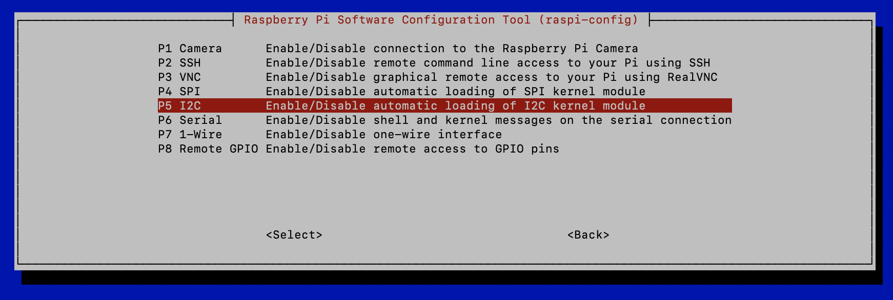
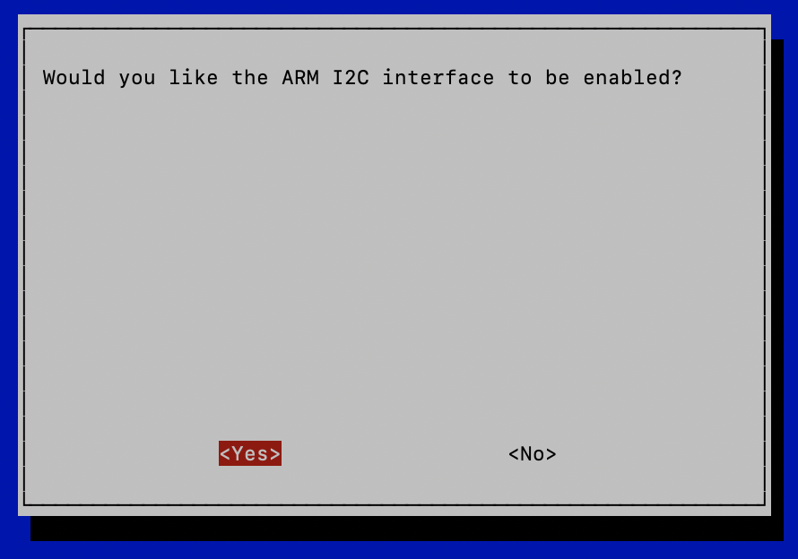
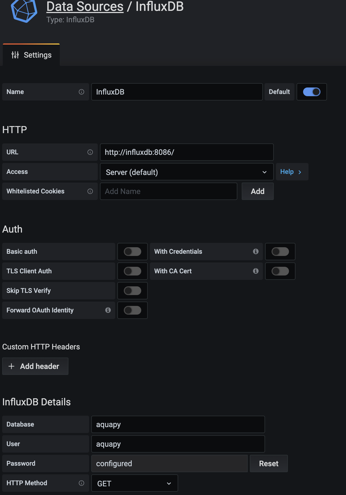
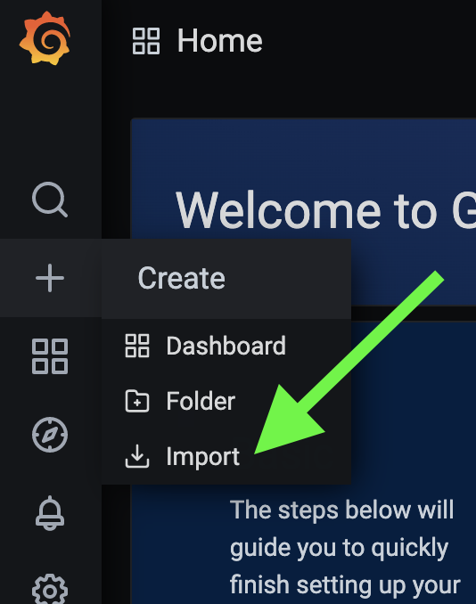

# AquaPy
DRF base aquarium controller

### Grafana Base Dashboard

### Parts List
* [Raspberry Pi 4 - Recommend 4Gb or 8Gb version](https://www.amazon.com/gp/product/B07TC2BK1X/ref=ppx_yo_dt_b_asin_title_o04_s00?ie=UTF8&psc=1)
* [CanaKit 3.5A Raspberry Pi 4 Power Supply (USB-C) - Any USB-C powersupple _should_ work](https://www.amazon.com/gp/product/B07TYQRXTK/ref=ppx_yo_dt_b_asin_title_o04_s00?ie=UTF8&psc=1)
* [Micro HDMI to HDMI adapter - Needed for initial setup, any micro HDMI to HDMI solution will work](https://www.amazon.com/gp/product/B07RZX9MCS/ref=ppx_yo_dt_b_asin_title_o02_s00?ie=UTF8&psc=1)
* [64Gb SanDisk Micro SD - Recommend 32Gb or larger](https://www.amazon.com/gp/product/B073JYVKNX/ref=ppx_yo_dt_b_asin_title_o01_s00?ie=UTF8&psc=1&tag=reef2reef-20)
* [Atlas Scientific i2c Toggler - Needed to ensure EZO circuits are set to i2c](https://www.amazon.com/gp/product/B07P9SDPTG/ref=ppx_yo_dt_b_asin_title_o00_s00?ie=UTF8&psc=1&tag=reef2reef-20)
* [Atlas Scientific Temperature Kit - Only using sensor and EZO circuit](https://www.amazon.com/gp/product/B07KYWJJY6/ref=ppx_yo_dt_b_asin_title_o04_s00?ie=UTF8&psc=1&tag=reef2reef-20)
* [Atlas Scientific Lab Grade pH Probe](https://www.amazon.com/gp/product/B086DYDXTL/ref=ppx_yo_dt_b_asin_title_o04_s01?ie=UTF8&psc=1&tag=reef2reef-20)
* [Atlas Scientific EZO-pH Circuit](https://www.amazon.com/gp/product/B00641R1PQ/ref=ppx_yo_dt_b_asin_title_o04_s02?ie=UTF8&psc=1&tag=reef2reef-20)
* [Whitebox Labs Tentacle T3 for Raspberry Pi](https://www.amazon.com/gp/product/B07PTNK9RP/ref=ppx_yo_dt_b_asin_title_o04_s03?ie=UTF8&psc=1&tag=reef2reef-20)

### Base Installation
1. Assemble Raspberry Pi including Whitebox Labs Tentacle T3
2. Using Raspberry Pi Imager on another PC, image microSD card with Raspbian OS
3. Insert microSD card into Raspberry Pi and connect a keyboard, mouse & monitor
4. Perform initial setup
5. Launch terminal
6. `sudo raspi-config`
    1. Select Interfacing Options
    
    2. Select I2C
    
    3. Select Yes 
    
    4. Select OK
7. Clone the repository
8. `cd AuqaPy`
9. `./install.sh`

### Grafana Base Configuration & Loading Base Dashbaord
1. In a web browser navigate to the IP address of the Raspberry Pi
    * For me it is `http://10.0.0.38/` but this is dependent on the IP assign to your Raspberry Pi on your local network
    * [Documentation on location IP address](https://www.raspberrypi.org/documentation/remote-access/ip-address.md)
2. Login with default credentials for Grafana and change initial password
    * username: `admin`
    * password: `admin`
3. Select Data Sources from Settings menu

4. Select InfluxDB from list
5. Populate the following information and click `Save and Test`
    * Name: `InfluDB`
    * URL: `http://influxdb:8086/`
    * Access: `Server (default)`
    * Whitelisted Cookies: Leave blank
    * Auth: Leave all sections disabled
    * Database: `aquapy`
    * User: `aquapy`
    * Password: `notverysecurepwd` ## This is the default password, if you'd like to change please change `INFLUXDB_USER_PASSWORD` in `aquapy.env`

6. Import base Grafana Dahboard
    1. Click the `+` symbol then click import
    
    2. Click `Upload JSON file` and navigate to location of `grafana.json` file from repo and upload
    3. Click Import
